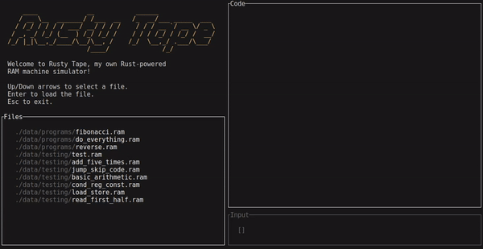
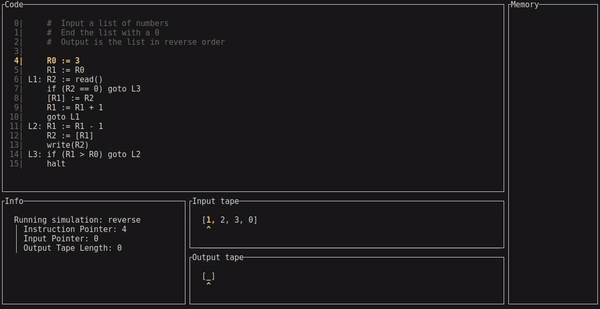

[](https://github.com/Kkobarii/Rusty-Tape/actions/workflows/tests.yml)

# Rusty Tape

Rusty Tape is a Rust-based RAM (Random Access Machine) simulator that provides a simple architecture for parsing and simulating RAM machine programs.
The machine itself is a simple model of computation that consists of a set of registers and a set of instructions that operate on those registers.

In Rusty Tape, you can write your own programs (or used the example ones) and simulate them in real-time to see how they work.
The CLI UI is written with Ratatui and provides a simple and cozy command-line interface for running the programs.
With a pretty responsive design and a focus on simplicity, Rusty Tape is a great tool for learning about RAM machines and how they work.
Also, it was a great tool for me to learn about Rust.

## Features

- **RAM Machine Execution**: Simulate a basic RAM machine with registers and instructions.
- **Custom Parser**: Parse `.ram` files with support for comments, labels, and various operations.
- **Extensive Test Suite**: Ensure correctness of parsing and execution using continually deployed tests.
- **Simple CLI UI**: Run programs with a simple and cozy command-line interface.

## Usage

### Running the Program

To run Rusty Tape, you need to have Rust installed on your machine. You can install it using `rustup`, which is the official Rust toolchain installer. It will also install `cargo`, the Rust package manager, which you will use to run the program.

On Unix or macOS systems, you can install Rust using the following command:
```bash
curl https://sh.rustup.rs -sSf | sh
```

On Windows, you can download the installer from the [official website](https://www.rust-lang.org/tools/install).

After installing Rust, you can clone the repository and run the program using the following commands:
```bash
git clone https://github.com/Kkobarii/Rusty-Tape.git
cd Rusty-Tape
cargo run
```

### Using the CLI

The CLI starts you at the main menu, where you can choose a program you want to run.
These programs are `.ram` files scanned automatically from the root folder.
You can navigate the menu using the arrow keys and select an option by pressing `Enter`.
You can also always exit the program by pressing `Esc`.

When you select a program, you will be prompted to enter the input tape.
The input tape is a sequence of integers separated by spaces that will be used as input for the program.
After entering the input tape (or leaving it blank), the simulation will start.



The simulation will run the program step by step, showing the current state of the machine and the output tape.
You can step through the program by pressing `Enter` or `Space` or return to the main menu by pressing `Esc`.
If the machine encounters an error, it will show an error message and stop the simulation.



### Writing a RAM file
To run a program, you need to write a `.ram` file with the instructions. They use the classic instruction set for RAM machines, which is a simple set of operations that can be used to write complex programs.

| Example                     | Explanation                                                                                                                              |
|-----------------------------|------------------------------------------------------------------------------------------------------------------------------------------|
| `R0 := 42`                  | Assigns the constant value `42` to register `R0`.                                                                                        |
| `R1 := R0`                  | Copies the value from register `R0` to register `R1`.                                                                                    |
| `R2 := [R1]`                | Loads the value from memory at the address in `R1` into `R2`.                                                                            |
| `[R1] := R2`                | Stores the value from `R2` into memory at the address in `R1`.                                                                           |
| `R3 := R1 op R2`            | Performs `op` on the values in `R1` and `R2`, storing the result in `R3`.<br>Supported operations: `+`, `-`, `*`, `/`.                   |
| `if (R0 rel R1) goto label` | Jumps to the instruction labeled `label` if the condition `R0 rel R1` is true.<br>Supported relations: `==`, `!=`, `<`, `>`, `<=`, `>=`. |
| `goto label`                | Jumps to the instruction labeled `label`.                                                                                                |
| `R5 := read()`              | Reads an input value and stores it in `R5`.                                                                                              |
| `write(R5)`                 | Writes the value in `R5` to the output.                                                                                                  |
| `halt`                      | Stops the execution of the program.                                                                                                      |
| *(empty)*                   | Represents an empty instruction (this is specific to my implementation).                                                                 |

Every instruction has two optional parts: a label and a comment. 
The label is a string of characters that ends with a colon (`:`), and which can be used to reference the instruction in a `goto` statement. 
The comment is a string of characters that starts with a hash (`#`) with purely informational purpose, it is ignored by the parser.

```
label: instruction # comment
```

Using these instructions you can write whatever your heart desires (as long as it's a RAM machine program, but why wouldn't it be).
Here is an example of a program:

```
# Program to calculate 2 * 5 in a convoluted way

R0 := 0  # Initialize sum
R1 := 2  # Increment
R2 := 5  # Counter
start: if (R2 <= 0) goto end
       R0 := R0 + R1
       R2 := R2 - 1
       goto start
end:   halt
```

There are some examples in the `./data` folder, so make sure to check them out.

### Running Tests
Tests are automatically run on every push to the main branch. To run them locally use:

```bash
cargo test
```
